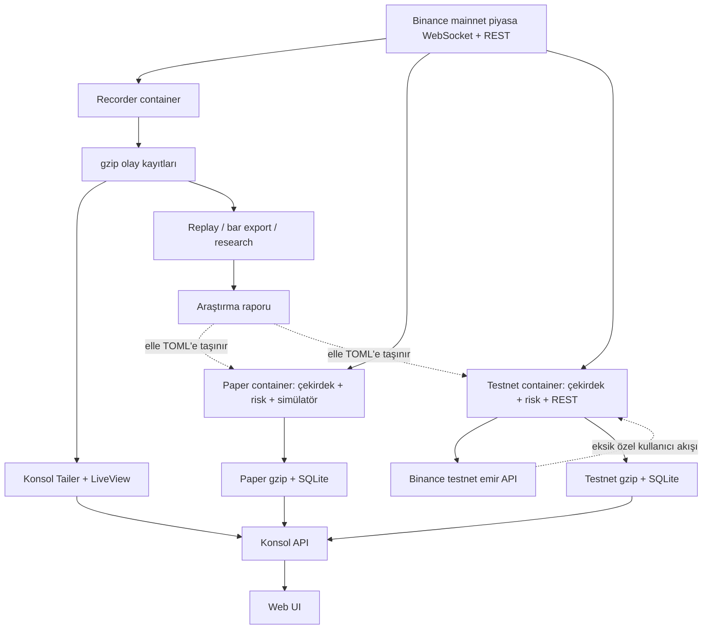

# Proje uçtan uca inceleme raporu — 2026-09-11

## Kapsam ve yöntem

`fbot/`, `scripts/`, `config/`, `ui/`, Docker/topoloji belgeleri ve test ağacı salt okunur incelendi. Python sözdizimi taramasında hata görülmedi; uygulama kodunda 72 dosya/5.883 satır, scriptlerde 22 dosya/2.260 satır, testlerde 67 dosya/399 test fonksiyonu sayıldı. Tam pytest çalıştırılmadı; bu nedenle testlerin yeşil olduğu iddia edilmemelidir. Kritik akışların bir bölümü dosya yazmadan bellek içi senaryolarla yeniden üretildi.

`config/paper.toml` ve `config/testnet.toml` içinde `allowed_cells = []`. Bu, giriş üretiminin bilinçli olarak kapalı olduğu anlamına gelir; aşağıdaki işlem güvenliği bulguları emir yolu etkinleştirildiğinde değerlendirilmelidir.

## Çalışma modeli

Recorder WebSocket/REST piyasa verisini olaylara dönüştürür, merkezi sıra numarası verir ve gzip JSONL kayıtlarına yazar. Çekirdek olayları piyasa görünümüne, barlara ve durum etiketlerine dönüştürür. Karar motoru `S0–S4` durumundan izinli hücreyi seçer; risk motoru teminat, maruziyet, kaldıraç, spread ve tazelik girdileriyle kararı reddeder veya emir üretir. Paper tarafı emri L2 simülatörüne, testnet tarafı REST adaptörüne yollar. Pozisyon yöneticisi dolum sonrasında SL/TP ve çıkış kurallarını üretir. Konsol, kayıtları yeniden oynatan `Tailer/LiveView` ile SQLite işlem verilerini birleştirir.

## Uygulama topolojisi

Dağıtım belgesi Cloudflare/nginx → `127.0.0.1:8787` konsol zincirini tarif ediyor. Container incelemesinde recorder ile paper/testnet aynı etikete sahip olsa da farklı image kimlikleriyle çalışıyordu; bu sürüm kaymasıdır, tek başına arıza kanıtı değildir.

## Kritik ve yüksek önem dereceli bulgular

| Önem | Bulgu ve kanıt | Etki / öneri |
|---|---|---|
| Kritik | Testnet özel kullanıcı stream'i çalışma yolunda açılmıyor. `on_user_event()` ve `map_user_event()` yalnızca tanımlı; başlangıçta sadece public/market bağlantıları kuruluyor. Mapper `order_fill` üretirken çekirdek `entry_fill/exit_fill` bekliyor. [main](/opt/traders/fbot/recorder/main.py:194), [testnet](/opt/traders/fbot/testnet/main.py:90), [mapper](/opt/traders/fbot/gateway/userdata_map.py:8) | Borsa dolumu çekirdek pozisyonuna bağlanmıyor; SL/TP yerel olarak oluşmayabilir. Private stream, ortak olay sözleşmesi, reconnect ve pozisyon kimliği tamamlanmalı. |
| Kritik | Restart mutabakatı bağlı değil; `CoreState.reconciled=True` ile boş başlıyor, testnet yalnızca bakiye sorguluyor. [engine](/opt/traders/fbot/core/engine.py:56), [reconcile](/opt/traders/fbot/core/reconcile.py:23) | Açık dış pozisyon/emir/koruma kaybolabilir. Başlangıçta REST snapshot + emir/algo eşlemesi tamamlanmadan giriş engellenmeli. |
| Kritik | Stop yenilemede yeni algo onaylanmadan eski stop için aynı batch'te `CancelAlgo` çıkıyor. [position](/opt/traders/fbot/core/position.py:214) | Yeni stop reddedilirse koruma boşluğu oluşabilir. Yeni onay gelene kadar eskisi korunmalı. |
| Kritik | Bayatlık pozisyonu `FROZEN` yapıyor; tick akışı frozen/protection eksik piyasa verisini atlıyor. [engine](/opt/traders/fbot/core/engine.py:155) | Veri kesintisi acil koruma zaman aşımını engelleyebilir. Koruma ve emergency close zamanlayıcısı veri tazeliğinden ayrılmalı. |
| Yüksek | Kısmi girişte metadata ilk dolumda `pop()` ediliyor; ikinci dolumda `pos_id` eksikliğiyle `KeyError` yeniden üretildi. [engine](/opt/traders/fbot/core/engine.py:137) | Miktar ve koruma yanlış kalabilir. Metadata emir kapanana kadar tutulmalı, miktar/ağırlıklı fiyat biriktirilmeli. |
| Yüksek | Kısmi stop/TP dolumunda kalan miktar `triggered` kuyruğundan düşüyor. [sim](/opt/traders/fbot/execution/sim.py:148) | Paper pozisyonun kalanı takip edilmeyebilir. Kalan miktar açıkça korunmalı. |
| Yüksek | User-data mapper işlem kimliğini taşımıyor; aynı dolum iki kez sayılabiliyor. [mapper](/opt/traders/fbot/gateway/userdata_map.py:16), [order state](/opt/traders/fbot/core/order_state.py:73) | Miktar, komisyon ve PnL şişebilir. Trade ID ve idempotent olay işleme gerekli. |
| Yüksek | Reddedilen/unknown/expired emirlerin pending temizliği ve belirsiz emir sorgusu eksik. [testnet](/opt/traders/fbot/testnet/main.py:64) | Sembol süresiz bekleyebilir veya tekrar emir riski oluşur. Terminal durum ve reconciliation akışı eklenmeli. |
| Yüksek | Risk girdilerinde beta maruziyeti `0`, depth boş, slippage `0`, rate sayaçları varsayılan; çıkış/cooldown alanlarının çalışma güncellemesi yok. [engine](/opt/traders/fbot/core/engine.py:275) | Risk kontrolleri ölçüm yerine yer tutucu değerlerle çalışabilir. Her alanın kaynağı ve bilinmiyor/kapalı durumu ayrılmalı. |
| Yüksek | Testnet hesap görünümü yalnızca bir bakiye sorgusuyla kuruluyor; kaldıraç borsadan okunmuyor. [testnet](/opt/traders/fbot/testnet/main.py:144), [risk](/opt/traders/fbot/core/risk.py:125) | Teminat yanlış olabilir veya `K10_leverage` sürekli ret verebilir. Available balance, leverage ve pozisyon snapshot'ı yenilenmeli. |
| Yüksek | Rate limiter header `override` değerine pencere zamanı bağlanmıyor; 10 saniyelik pencere geçse de engel kalabiliyor. [rate_limit](/opt/traders/fbot/core/rate_limit.py:21) | Emirler süresiz engellenebilir. Header sayaçları interval kimliğiyle expire edilmeli. |
| Yüksek | Testnet REST çağrısı olay döngüsünde senkron; HTTP timeout'u WS ve protection tick'lerini bloklayabilir. [testnet](/opt/traders/fbot/testnet/main.py:70), [gateway](/opt/traders/fbot/gateway/testnet.py:34) | Ağ gecikmesi işlem güvenliğini etkiler. Emir yürütücüsü döngüden ayrılmalı. |
| Yüksek | Testnet emirleri testnet'e giderken piyasa ve `exchange_info` mainnet'ten geliyor. [testnet](/opt/traders/fbot/testnet/main.py:112) | Fiyat, likidite ve filtre ortamları uyuşmayabilir. Ortam uçtan uca tutarlı olmalı. |
| Yüksek | Kısmi çıkışlarda yalnız son exit price saklanıyor; gerçekleşen PnL dolum bazında birikmiyor. [paper trader](/opt/traders/fbot/paper/trader.py:164) | Geçmiş ve maliyet raporları yanlış olabilir. Fill ledger üzerinden PnL hesaplanmalı. |
| Yüksek | Araştırma keşif/doğrulama sınırı, ileri ufku taşan işlemleri ayırmıyor; validation ortalaması seçimde kullanılıyor. [barrier scan](/opt/traders/scripts/barrier_scan.py:79) | Bağımsız test kanıtı zayıflıyor. Purged zaman bölmesi, blok bootstrap ve dokunulmamış test dönemi gerekli. |
| Yüksek | Barrier değerlendirmesi giriş kapanış fiyatından ve tam SL/TP fiyatından yapılıyor; gap/latency/slippage ve eksik ufuk etkisi eksik. [barrier](/opt/traders/fbot/research/barrier.py:30) | Araştırma sonucu gerçek yürütmeyi temsil etmeyebilir. İşlenebilir sonraki fiyat ve tamamlanmış horizon kullanılmalı. |

## Veri akışı, kayıt ve izolasyon

- Tazelik `public/market` kategorisinde tutuluyor; sembol ve stream bazında değil. Y sembolü canlıyken X sembolünün eski fiyatı bayat görünmeyebilir. [engine](/opt/traders/fbot/core/engine.py:305)
- Karar, olay yönlendirmesinden sonra tazelik güncellemesi yapılmadan çalışıyor; aynı olay sonunda bayatlık işareti oluşuyor. [engine](/opt/traders/fbot/core/engine.py:89)
- `last_agg_id` tekrar kontrolünde kullanılmıyor. Aynı agg trade bar hacmini iki kez artırabiliyor; eski timestamp bar sırasını `0 → 60000 → 0` yapabiliyor. [market](/opt/traders/fbot/core/market.py:39)
- Defter sıra kopukluğunda `synced=False` olsa da eski simülatör defteri geçersiz kılınmıyor; yeniden snapshot gelmeden eski fiyatla dolum oluşabildi. [orderbook](/opt/traders/fbot/orderbook.py:66), [paper trader](/opt/traders/fbot/paper/trader.py:124)
- `walk()` defter seviyesini tüketmediği için aynı snapshot üzerinde tekrar `poll()` çağrıları aynı likiditeyi yeniden doldurabiliyor. [sim](/opt/traders/fbot/execution/sim.py:51)
- `reduce_only` simülatörde mevcut pozisyon miktarıyla sınırlandırılmıyor; pozisyonsuz iki birimlik reduce-only emir iki birim exit üretti. [sim](/opt/traders/fbot/execution/sim.py:183)
- Recorder açık dosyadan son sıra numarasını geri yüklemiyor; çökme ve aynı rotasyon kovasında yeniden başlama dosya üzerine yazma ve sıra tekrarı riski taşıyor. [writer](/opt/traders/fbot/recorder/writer.py:33)
- Kuyruk dolunca olay kayda alınmasa da trader'a iletilebiliyor; writer görevi ölürse ana süreç bunu güvenli duruma bağlamıyor. [recorder](/opt/traders/fbot/recorder/main.py:76)
- Compose paper servisi geniş `data/state` volume'u, testnet servisi ortak `.env` alıyor. Ortam izolasyonu belgede tarif edilenden daha geniş. [compose](/opt/traders/docker-compose.yml:40)

## Frontend ve konsol

- Tailer geçmiş başlangıç penceresi dışındaki dosyaları `done` kümesine koymuyor; normal döngüde eski dosyaları yeniden bekleyen olarak görüyor. Bu, görünüm zamanının gerilemesine ve gecikmiş verinin canlı gibi işlenmesine yol açabilir. [server](/opt/traders/fbot/api/server.py:177)
- API; kayıt replay'i, SQLite, araştırma JSON'u, heartbeat ve latency raporunu tek snapshot'ta birleştiriyor. Kartlar aynı zamana aitmiş gibi görünebilir. [server](/opt/traders/fbot/api/server.py:242)
- Bazı risk kartları gerçek verdict yerine mevcut yapılandırma veya varsayılanlarla “ok” gösteriliyor; API hatasında önceki snapshot korunuyor. [UI](/opt/traders/ui/console-logic.html:194)
- `age_bars`, bar listesi kırpıldıktan sonra `len(bars)` ile hesaplandığından durum yaşı ilerlemeyebilir. [LiveView](/opt/traders/fbot/api/live_view.py:102)
- `/api/health` doğrudan `ok: true` dönüyor; veri yaşı, tailer ilerlemesi ve kritik görev sağlığı sınanmıyor. [server](/opt/traders/fbot/api/server.py:330)
- Yeni görünüm cache'i yalnız geçmiş yükleme aşamasında ilerliyor. Cache yazma hatası yakalanmadığı için izin/disk problemi tailer thread'ini durdurabiliyor. [server](/opt/traders/fbot/api/server.py:195)

## Yapılandırma ve zamanlama

Yükleyici `bar_ms=0` ve `rotate_minutes=0` değerlerini kabul ediyor; kullanımda sırasıyla `ZeroDivisionError` oluşuyor. Süre, pencere, miktar ve oranlar başlangıçta pozitiflik ve tutarlılık açısından doğrulanmalı. [config](/opt/traders/fbot/config.py:56)

Beta takipçisi ardışık barlar arasında sabit 60 saniye arıyor. `bar_ms=300000` ile aynı seri beta üretemiyor. Zaman dilimi değiştirilecekse beta serisinin açıkça 1 dakikalık tutulması veya yapılandırılmış bar süresi kullanması gerekir. [beta tracker](/opt/traders/fbot/core/beta_tracker.py:20)

## Güçlü taraflar ve sınırlar

Parasal hesaplamalarda `Decimal`, olay sıralaması, config hash'leri, non-root container, fail-closed boş strateji hücreleri, masked credential çıktıları ve geniş test kapsamı olumlu. Bunlar yalnızca tasarım/koruma göstergesidir; testnet uçtan uca dolum, restart mutabakatı veya kârlılık kanıtı değildir.

## Öncelikli doğrulama sırası

1. Private stream + fill sözleşmesi + restart mutabakatı: tam/kısmi/tekrar dolum ve dış emir senaryoları.
2. Koruma yaşam döngüsü: place ACK önceliği, ret/unknown, bağlantı kaybı, eksik piyasa ve emergency close.
3. Hesap/risk girdileri: gerçek available balance, leverage, depth, slippage, rate limit ve sembol bazlı tazelik.
4. Paper simülatörü: miktar korunumu, defter tüketimi, reduce-only sınırı, kısmi exit ve fill ledger PnL.
5. Kayıt kurtarma ve görev gözetimi: crash, disk doluluğu, queue overflow, cache hatası.
6. Frontend: kaynak/ortam/zaman etiketleri, stale snapshot davranışı, gerçek health/readiness uçları.
7. Araştırma: purged zaman bölmesi, bağımsız test dönemi, gap/latency/slippage ve blok bootstrap.

Bu maddeler doğrulanmadan `allowed_cells` etkinleştirilmesi veya testnet davranışının strateji başarısı olarak yorumlanması güvenilir değildir.
